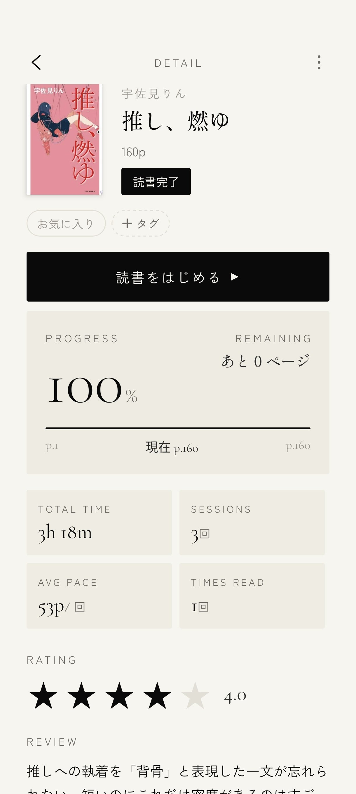
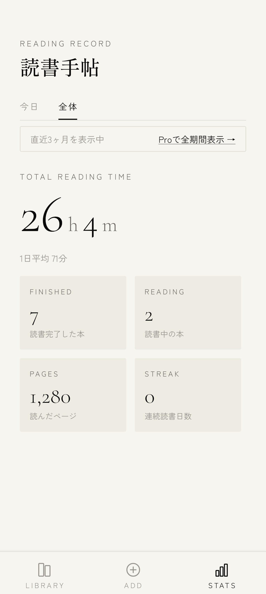
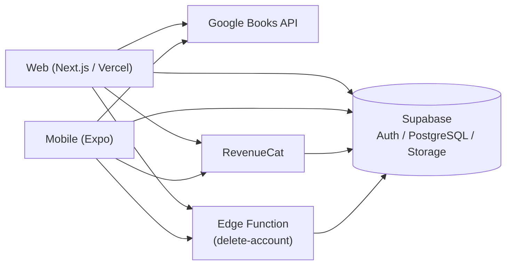

# デジタル栞（Yondle）

紙の本の「どこまで読んだか忘れた」をなくす、アナログの本向けの読書記録アプリ。書影の自動取得から読書タイマー、統計まで、Web とモバイル(iOS / Android)の両方で使えます。

## 今すぐ使う

**[https://digital-siori.vercel.app](https://digital-siori.vercel.app)** — メールアドレスだけで今すぐ始められます。

iOS / Android アプリも実装済みで、ストア公開に向けて準備中です。

## スクリーンショット

| 本棚 | 書籍詳細 | 読書タイマー | 統計 |
|---|---|---|---|
|  |  |  |  |

## 主な機能

- メールアドレスによるアカウント登録・ログイン（Supabase Auth）
- Google Books API による書籍検索と本棚への登録
- タグによる本棚の整理・絞り込み
- 読書タイマーによる読書時間の計測と、ページ進捗の記録
- 読書統計（今日・累計）の可視化
- 書籍ごと・セッションごとのメモ
- 評価・レビューの記録（5段階評価とレビュー文）
- プロフィール画像（アバター）のアップロード
- Pro プランのサブスクリプション（RevenueCat）
- アカウント削除機能

## 技術スタック

| 領域 | 技術 |
|---|---|
| Web フロントエンド | Next.js 15 (App Router) + TypeScript |
| モバイル | Expo + React Native + TypeScript |
| スタイル | Tailwind CSS |
| 認証・DB | Supabase (Auth + PostgreSQL + Edge Functions) |
| データフェッチ・キャッシュ | TanStack Query（モバイル） |
| 課金 | RevenueCat（Web版は Stripe 経由の Web Billing にも対応） |
| 書籍情報 | Google Books API |
| ホスティング | Vercel |

## アーキテクチャ

Web とモバイルは同一の Supabase プロジェクトを共有しており、どちらから登録した本や読書記録も同じデータとして扱われます。課金状態（Pro）も RevenueCat 経由で両プラットフォーム間で共有されます。



## 技術的な工夫

**Web 先行開発からモノレポ化、モバイル追加への変遷**
Next.js の Web アプリとして開発を始め、モバイル対応を見据えて `web/` サブディレクトリへのモノレポ構造に移行したのち、Expo でモバイルアプリを追加した。先に Web で機能とデータモデルを固めてからモバイルへ横展開したことで、スキーマ（`supabase/schema.sql`）を1つに保ったまま両プラットフォームを実装できた。

**Babel プラグインの不具合調査と修正**
RevenueCat SDK 導入時、`@supabase/supabase-js` の CJS ビルドが `import(OTEL_PKG)`（文字列リテラルではなく識別子を渡す動的 import）を含んでおり、既存の Babel プラグインは文字列リテラルの動的 import しか処理できず、この形が Hermes バンドルに残って `Invalid expression encountered` ビルドエラーになっていた。Babel のスコープ解析で定数の変数束縛を辿って解決する形に直し、修正した。

**アカウント削除機能とストア審査要件への対応**
Google Play はアプリ内からのアカウント削除手段を要求している。Supabase Edge Function（`delete-account`）で関連データを含めた削除処理を実装し、Web 側にも削除ガイドとプライバシーポリシーのページを用意した。

**Row Level Security によるデータ分離**
`books` / `reading_sessions` / `tags` / `book_tags` / `book_memos` などの全テーブルに `auth.uid() = user_id` の RLS ポリシーを適用し、Storage のバケットもユーザーごとにフォルダ分離している。クライアントから直接 Supabase を叩く構成のため、他人のデータへのアクセス防止をアプリ側ではなく DB 側で保証している。

## リポジトリ構成

```
digital-siori/
├── web/      # Next.js Web アプリ（LP・本棚・統計・アカウント管理） → web/README.md
├── mobile/   # Expo モバイルアプリ（iOS / Android、ストア公開準備中）
├── poster/   # 紹介用 A4 ポスター（HTML / PDF / PPTX 生成スクリプト）
└── docs/     # 設計ドキュメント・スクリーンショット
```

## ドキュメント

- [web/README.md](web/README.md) — セットアップ・デプロイ手順
- [docs/design/](docs/design/) — 設計ドキュメント・画面デザイン
- [docs/revenuecat_expo_googleplay_guide.md](docs/revenuecat_expo_googleplay_guide.md) — RevenueCat 導入手順

## ライセンス

[MIT](LICENSE)
